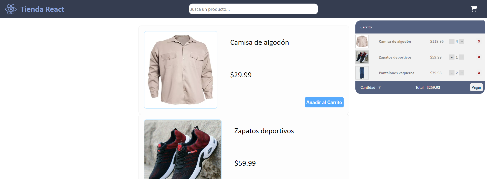

## Mini-Proyecto - Tienda - 2024

> [!NOTE]
> _El codigo esta comentado de explicaciones._

> **_Practica en React_**

#### --- Vista Previa ---

#### --- Cosas que me faltan para la tienda ---

- [x] Hacer que se **cuenten los productos** que ya fueron añadidos anteriormente.
- [x] **Filtrar los productos** a traves de un buscador.
- [x] Hacer **diseño** principal de la pagina.
- [x] Permitir al usuario que sume cuantos quiere tambien en el carrito.
- [x] Hacer la implementacion del boton para pagar y poner costo total del carrito.
- [ ] _Implementar una BD para fetchear los productos desde ahi - mas adelante_.
- [ ] _Hacer un sistema de label/categorias de productos - mas adelante_.

---

#### --- Errores que siento que cometí en el proyecto ---

- **SOLUCIONADO** - La herramienta de React, StrictMode me esta duplicando la cantidad de productos que se suman al carrito. Esto fue cuando empece a utilizar useReducer y useContext. Hay algo que no le esta gustando. Tengo que verlo, por ahora desactive el StrictMode.

---

### --- Commits ---

> Del actual al antiguo

| **'implementando hook useEffect'** - Fecha 22/02 |

- Implemente el hook useEffect que no lo habia tenido en mente cuando inicie este proyecto.
- Se me ocurrio meterlo en el componente InfoTotal (archivo Carrito.jsx), ya que cada vez que se modifica la variable de estado productosCarrito se llama al Efecto y hace el calculo de la cantidad total y del precio total a pagar.
- Dejo la documentacion de [React respecto al hook useEffect](https://es.react.dev/learn/synchronizing-with-effects).

| **'corrigiendo codigo y mas limpieza'** - Fecha 20/02 |

- Corregi el codigo que me estaba dando mal el StrictMode respecto a la cantidad de x producto. Aun asi creo que hay otras deficiencias pero no las logro encontrar.
- Limpie mas el codigo borrando los 2 archivos que cree ayer, y los compacte todo en 1, el useReducer() y el createContext(). Me di cuenta de que lo podia hacer mas limpio todavia cuando lei la documentacion de [React](https://es.react.dev/learn/scaling-up-with-reducer-and-context). Entonces cree el componente CarritoProvider.jsx.
- En cuanto a corregir habia errores de mi parte que modificaban mal la variable de estado. Empece a usar .map() y filter() para esos casos.

| **'hooks useContext y useReducer'** - Fecha 19/02 |

- Cambie varias cosas para practicar con los hooks useReducer y useContext.
- useReducer creo que en el useState que tenia de productosCarrito era necesario, ya que hacia muchas cosas.
- useContext lo use en algunas ocasiones cuando la prop que tenia que pasar llegaba muy abajo del arbol de nodos.
- Cree aparte en assets Context.js y carritoReducer.js, con este codigo aparte, me queda mas limpio App.

| **'info total del carrito y diseño'** - Fecha 16/02 |

- Hice un nuevo componente, InfoTotal, dentro de Carrito.jsx, que se complementa obviamente con el componente Carrito.
- Hice algunos ajustes en cuanto al diseño del carrito.
- Tache un punto de cosas que me faltan, porque no lo sentia tan necesario de hacer.
- Anote unos puntos que por ahi mas adelante haga.

| **'buscar producto'** - Fecha 15/02 |

- Hoy hice solo que se puedan filtrar los productos, no es perfecto porque no se basa en palabras sino en los caracteres.

| **'termine diseño principal'** - Fecha 14/02 |

- Hoy me enfoque solo en la parte de front, cree los archivos .css.
- Hice el header con el boton del carrito funcional.
- Modifique el diseño de como se veia la lista de productos, al final la termine haciendo al estilo mercado libre.

| **'modificando Carrito y diseño'** - Fecha 13/02 |

- Hice para que los productos que se añadan al carrito, si ya fueron añadidos antes, no se agregen sino que se sumen.
- Tambien hice la opcion de aumentar o dismunuir la cantidad de un producto dentro del Carrito.
- Hice el diseño de los productos pero no estoy satisfecho, lo voy a cambiar. Quiero hacer un diseño mas mercadolibre.
- Cree los archivos .css y ProductoEnCarrito.jsx, para que no se me llene tanto de codigo el Carrito.

| **'haciendo la logica'** - Fecha 12/02 |

- Cree los componentes, Carrito,ListaDeProductos y Producto.
- Pense e implemente la logica de añadir productos al carrito y de borrarlos del carrito.

---
